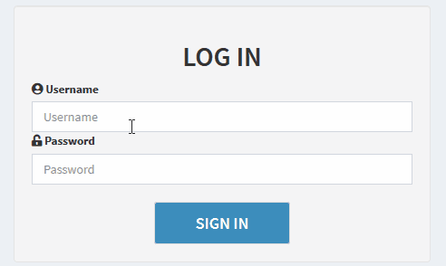
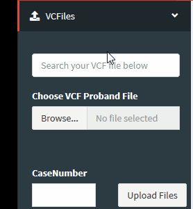
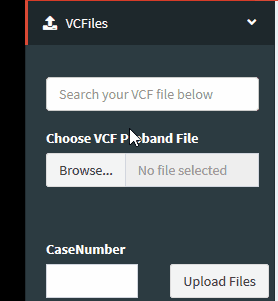
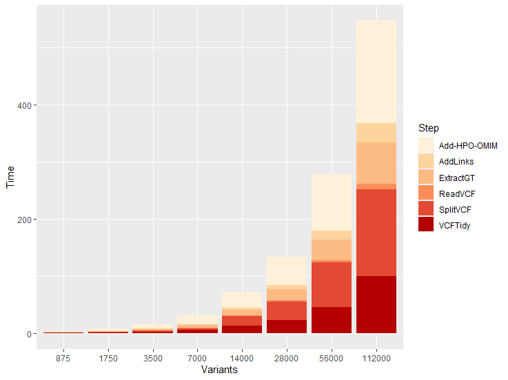
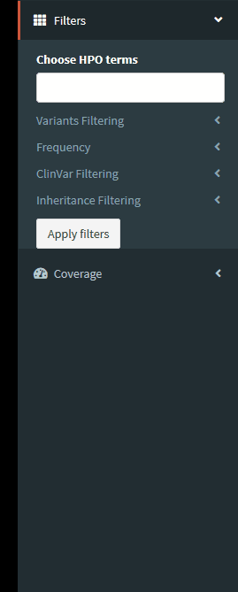

PGVWeb
==========

Este repositorio contiene todos los scripts necesarios para reproducir la aplicación web de priorización de variantes genéticas desarrollada en el TFM de Carmen Núñez García, a través de la Universitad Oberta de Catalunya (UOC) en Enero de 2021. 

Contexto
--------

En la secuenciación completa de un exoma o un genoma se detectan gran cantidad de variantes genéticas que podrían ser patogénicas. Determinar cuál o cuáles de ellas son causales de una patología concreta es una tarea compleja y muy costosa. Una aplicación adecuada que permita visualizar e integrar toda la información sobre las variantes genéticas, e incluya algoritmos de priorización puede facilitar en gran medida el trabajo en el ámbito clínico y mejorar las tasas diagnósticas de los estudios genéticos en enfermedades congénitas.

Dependencias
------------

- Todo el código está escrito en R version 4.0.2.
- Las librerías empleadas son:
  - shiny
  - shinydashboard
  - DT
  - tibble
  - vcfR
  - RSQLite
  - splitstackshape
  - base
  - stringi
  - plyr
  - dplyr
- Las instrucciones para descargar y preparar el entorno de la aplicación se encuentran en la carpeta "environment" de este repositorio.

Funcionamiento de la aplicación
--------------------

### Inicio

Para entrar en la aplicación será necesario estar registrado previamente. A continuacion, se muestra un usuario con sus credenciales a modo de ejemplo. 

user: user 

password: user

    

### Ejecución

La aplicación se divide en tres partes:
- Importación de archivos
- Aplicación de filtros
- Visualización de variantes

#### Importación de archivos
Para importar los archivos será necesario disponer de un archivo en formato VCF (Variant Call Format) correctamente anotado. Además, opcionalmente se podrá subir un fichero de cobertura obtenido a partir de los archivos generados en la secuenciación.

Existen dos opciones para la subida de archivos VCF:

- Cargar de archivos previamente subidos 

 

- Subir archivos _denovo_

El rendimiento de la aplicación depende en gran medida del número de variantes del archivo VCF. A continuación, se muestra una gráfica donde se observa el tiempo de ejecución (en segundos) frente al número de variantes del archivo.

    

En la aplicación se ha incorporado una barra en la que se muestra el estado del proceso. Una vez que el proceso de subida e importación esté completado se podrá realizar el paso siguiente.  

  

#### Aplicación de filtros
La aplicación permite aplicar diferentes filtros para priorizar unas u otras variantes en función de la región a la que afectan, clasificación por otros laboratorios, frecuencia poblacional, etc. 

    

#### Visualización de variantes
Una vez aplicados todos los filtros, se mostrará una tabla como la siguiente:

    

Opcionalmente, se podrá subir un archivo de cobertura obtenida en la secuenciación en el apartado Coverage del panel de opciones. Una vez cargado en la aplicación, para cada gen seleccionado se mostrará una tabla de cobertura como a continuación:

    

